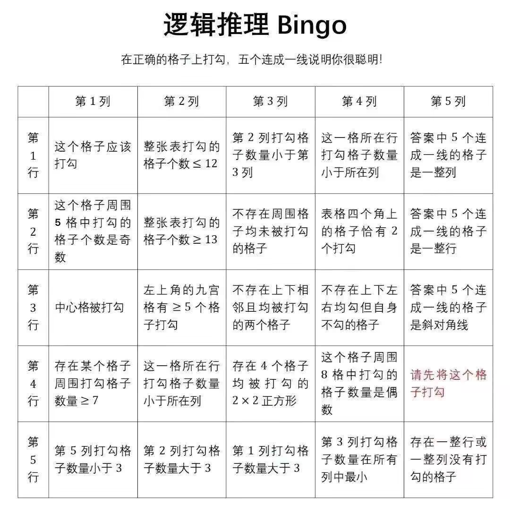

# BingoLogic 谜题解答

## 谜题内容

**谜题内容表格：**
|     | A(1) | B(2) | C(3) | D(4) | E(5) |
|-----|------|------|------|------|------|
| 1   | 这个格子应该打勾 | 整张表打勾的格子个数≤12 | 第2列打勾格子数量小于第3列 | 这一格所在行打勾格子数量小于所在列 | 答案中5个连成一线的格子是一整列 |
| 2   | 这个格子周围5格中打勾的格子个数是奇数 | 整张表打勾的格子个数≥13 | 不存在周围格子均未被打勾的格子 | 表格四个角上的格子恰有2个打勾 | 答案中5个连成一线的格子是一整行 |
| 3   | 中心格被打勾 | 左上角的九宫格有≥5个格子打勾 | 不存在上下相邻且均被打勾的两个格子 | 不存在上下左右均勾但自身不勾的格子 | 答案中5个连成一线的格子是斜对角线 |
| 4   | 存在某个格子周围打勾格子数量≥7 | 这一格所在行打勾格子数量小于所在列 | 存在4个格子均被打勾的2x2正方形 | 这个格子周围8格中打勾的格子数量是偶数 | 请先将这个格子打勾 |
| 5   | 第5列打勾格子数量小于3 | 第2列打勾格子数量大于3 | 第1列打勾格子数量大于3 | 第3列打勾格子数量在所有列中最小 | 存在一整行或一整列没有打勾的格子 |

## 最终答案

**结果表格：**
|     | A(1) | B(2) | C(3) | D(4) | E(5) |
|-----|------|------|------|------|------|
| 1   |      |  ✓   |      |  ✓   |  ✓   |
| 2   |  ✓   |      |      |  ✓   |      |
| 3   |      |      |      |  ✓   |      |
| 4   |      |      |      |  ✓   |  ✓   |
| 5   |      |      |      |  ✓   |  ✓   |

**答案：第4列（D列）**
- 打勾的格子：D1, D2, D3, D4, D5
- 这是一整列，满足"答案中5个连成一线的格子是一整列"的条件

## 分析过程

**符号说明：**
- `!` : 非（否定）
- `|` : 或（析取）
- `&` : 且（合取）
- `->` : 蕴含（若P则Q，P->Q表示"若P则Q"）

- E4 : 初始条件
- !E3 : E3->E1|E5, E3->!E1, E3->!E5